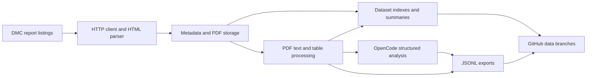

# Sri Lanka disaster report datasets

A standalone Python pipeline for collecting reports from the Sri Lankan Disaster
Management Centre, extracting PDF text and tables, analyzing reports with OpenCode,
and publishing datasets on GitHub.

| Dataset label | Content |
|---|---|
| `lk_dmc_situation_reports` | Disaster situation reports |
| `lk_dmc_weather_forecasts` | Weather forecasts |
| `lk_dmc_river_water_level_and_flood_warnings` | River levels and flood warnings |
| `lk_dmc_landslide_warnings` | Landslide warnings |

## Architecture



The CLI coordinates independent modules in `src/dmc`. `sources.py` configures the
four categories; `client.py` handles HTTP; `parser.py` produces report metadata;
`storage.py` handles atomic file writes; `processing.py` extracts text and tables;
`summaries.py` builds indexes; `opencode.py` talks to the analysis service;
`analysis.py` saves resumable results; and `publishing.py` creates local JSONL
exports. GitHub Actions commits these files to the dataset branches.

Runtime dependencies and their versions are declared in `pyproject.toml`.
`uv.lock` records the complete resolved environment. The pipeline runs on standard
Python and does not require a custom Docker image.

## Local setup

Requires Python 3.11 or newer and [uv](https://docs.astral.sh/uv/getting-started/installation/).

```powershell
uv sync --locked
uv run dmc --help
uv run pytest -q
```

A pip environment can instead install with `python -m pip install -r requirements.txt`.
Use uv for the fully locked environment and development checks.

Collect one page and process at most one pending PDF:

```powershell
uv run dmc scrape lk_dmc_situation_reports --max-pages 1 --max-documents 1
```

Collect listing metadata without downloading PDFs:

```powershell
uv run dmc scrape lk_dmc_weather_forecasts --metadata-only --max-pages 2
```

All output defaults to `data/`, which is ignored by Git in the code checkout.
`--data-dir` selects a different root. `--max-seconds` defaults to 300 seconds for
metadata collection and a separate 300 seconds for PDF processing. Limits are
cooperative: an active PDF extraction can finish after the stage budget. HTTP has
30-second socket timeouts, deadline checks, capped retry delays, and a 50 MiB
response/download limit. `--max-pages` defaults to 10,000. `--max-documents` counts
processing attempts, including failures, and does not limit listing metadata.

Collection starts with the newest listing page each run. To backfill more history,
increase the page and time budgets. Existing metadata is preserved; already
processed PDFs are skipped. Failed processing is retried on subsequent runs.

The CLI prints a JSON run result. `limited: true` means a configured bound was
reached; it does not claim that the complete source history was collected.
Failures return exit code 1; usage errors return 2.

## Stored data and migration

```text
data/<dataset>/<decade>/<year>/<document-id>/
    doc.json          Source metadata
    doc.pdf           Original downloaded PDF
    doc.txt           Extracted text
    blocks.json       Page text records: page and text
    processing.json   Extraction status and pages without text
    analysis.json     OpenCode result, provenance, source hash, and status
    tabular/*.csv     Extracted ruled tables, when available
```

Each dataset also contains `summary.json`, `run.json`, `README.md`, and
`docs_all.tsv` (plus recent-document TSV subsets when enough records exist).

Historical metadata fields, the document-ID shortening algorithm, and the
`<decade>/<year>/<document-id>` layout are retained. Matching metadata records are
not rewritten, including custom fields. Different PDF URLs sharing a title and
time are stored with a deterministic ID suffix rather than overwriting a record.

To use an existing data branch checkout, point the new CLI at its `data` directory:

```powershell
uv run dmc scrape lk_dmc_situation_reports --data-dir ../dataset/data
```

The old workflow script paths remain available after installation:

```powershell
uv run python workflows/pipeline.py lk_dmc_situation_reports 300 --data-dir ../dataset/data
uv run python workflows/build_global_readme.py --data-dir ../dataset/data
```

The former inherited document-class Python API has been replaced by `SOURCES`,
`Report`, and `run_pipeline`. Local publication is now explicit.

PDF extraction uses [pdfplumber](https://github.com/jsvine/pdfplumber). It extracts
text layers and ruled tables; it does not perform OCR or recompress PDFs. Scanned
pages are reported in `processing.json`. New blocks contain page-level text, so
consumers expecting the former detailed block structure need adaptation. Exact
extraction parity is not guaranteed. Existing processing outputs without a status
file are regenerated on their first processing run; original PDFs remain intact.

New metadata uses `lang: "und"` when document language is unknown, rather than
inferring it from website navigation. DMC listing times are interpreted as Sri
Lanka time (UTC+05:30). Existing metadata language and timestamps remain intact.

## OpenCode analysis

Configure your HTTPS OpenCode server using process environment variables:

```powershell
$env:OPENCODE_BASE_URL = "https://your-opencode-server.example"
$env:OPENCODE_USERNAME = "opencode"
# Read the password without echoing it or recording it in shell history:
$credential = Get-Credential -UserName "opencode" -Message "OpenCode credentials"
$env:OPENCODE_PASSWORD = $credential.GetNetworkCredential().Password
# Optional: select a configured provider/model; otherwise use the server default.
$env:OPENCODE_MODEL = "provider/model"
uv run dmc opencode-health
uv run dmc analyze lk_dmc_situation_reports --max-documents 1 --export
```

An example variable list is in `.env.example`; the CLI does not automatically
load dotenv files. Store the password in environment variables or GitHub Actions
secrets. Model-provider credentials belong on the OpenCode server. The HTTP client identifies
itself as `DMC-Report-Collector/3.0`; generic Python User-Agents can be rejected by
reverse-proxy bot filters before reaching OpenCode.

Analysis uses the OpenCode session API: `POST /session`, then
`POST /session/{sessionID}/message`, requesting raw JSON text with the schema
in the system prompt. The client validates the result locally. This avoids
depending on the server's native structured-output tool. Sessions deny all tool
permissions. The prompt treats report contents as untrusted data and requests
only source-supported facts. Returned fields are validated before saving:
`summary`, `disaster_types`, `locations`, `report_date`, `impacts`, and `warnings`.
Unknown dates are null and unknown lists are empty. These are AI-generated
interpretations; the original PDF and text remain the authoritative source.
See the [OpenCode server documentation](https://dev.opencode.ai/docs/server/).

`analysis.json` records the result, source SHA-256, configuration hash, schema
version, timestamp, and available session/model identifiers. Unchanged successful
results are skipped. Changed text, endpoint, explicit model, or schema version
causes reanalysis. Use `--force` to reanalyze after changing the server's default
model. Errors are saved and retried on later runs. New work is processed before errors;
failed reports rotate by last-attempt time so one persistent failure cannot block
all later reports. Empty or missing text is
skipped; OpenCode does not add OCR to scanned PDFs. Sessions and submitted report
text remain on your OpenCode server under its retention policy.

Default analysis limits are ten attempted reports, 300 seconds per run, and
40,000 characters per report. Set `--max-documents`, `--max-seconds`, and
`--max-characters` on `analyze` to change them. Oversized reports fail explicitly;
text is never silently truncated. Limits are cooperative and socket timeouts
bound individual waits. POST requests are not automatically replayed after a
transport error, since the server may already have accepted them. Retrying a
failed run can create another session and incur additional model usage.

To collect, analyze, and export in one command:

```powershell
uv run dmc scrape lk_dmc_situation_reports --max-pages 1 --max-documents 1 --analyze --analysis-max-documents 1 --export
```

For `scrape`, analysis limits use the `--analysis-max-documents`,
`--analysis-max-seconds`, and `--analysis-max-characters` flags. A collection error
skips analysis; requested exports still retain the available local records.

## Dataset publishing

OpenCode supplies analysis. Dataset files are published on the repository's
`data_<dataset-label>` branches, including each report's `analysis.json`.
Prepare JSONL exports locally without service credentials:

```powershell
uv run dmc export lk_dmc_situation_reports
```

`exports/docs.jsonl` contains all metadata, available text, and a matching
completed `analysis` result (or null). `exports/chunks.jsonl` contains nonempty
text chunks of at most 2,000 characters with 200-character overlap. Whitespace
windows are omitted. Metadata-only reports remain in the document export.
Invalid source metadata stops export before replacing existing files; invalid
or stale analysis is omitted without losing the source record. The exporter
prepares local files; the GitHub workflow commits and pushes them to the data
branch. For manual publication, commit and push your data branch checkout after
exporting into it.

Version 3 removes the old `publish` command, `--publish`, and the previous
hub-specific settings. Use `analyze --export` for enriched output or `export`
for source data alone. Existing source archives remain readable; previously
published remote datasets are not deleted by this migration.

## GitHub Actions

The collection workflow runs every two hours, with one job per dataset. It uses
standard Python, installs the locked environment, and runs tests before scraping.
It serializes updates to each data branch, saves successful collection progress
when a run has errors, and uses ordinary pushes. Rebase conflicts stop the push.
OpenCode analysis runs after successful collection when configured, followed by
JSONL export and a GitHub push. Collection, analysis, or export errors fail the job
after successful progress has been saved. Each run analyzes at most ten pending
reports per dataset. Source collection continues even if the analysis service fails.

Setup in the repository where these workflows will run:

1. Provide the four existing `data_<dataset-label>` branches, containing each
   archive under `data/<dataset-label>`. These archives are not bundled with the
   source download. Empty data branches can be used to begin collecting anew.
2. Allow the workflow's built-in `GITHUB_TOKEN` to write repository contents.
3. For OpenCode analysis, set repository variable `OPENCODE_BASE_URL` and secret
   `OPENCODE_PASSWORD`. Optionally set `OPENCODE_USERNAME` (default `opencode`)
   and `OPENCODE_MODEL` (`provider/model`). If URL and password are both absent,
   collection, export, and GitHub publication still run. Partial configuration
   fails with a clear error. The endpoint must be accessible from hosted runners.
4. For a larger historical backfill, manually run the pipeline with an increased
   `max_dt` time budget.

The README workflow reads summaries from the current repository's data branches
through the GitHub Contents API, using the built-in token for private repositories.
It only updates the marked statistics section below, preserving setup instructions.
For local access to private repositories, set `GITHUB_TOKEN`, or use locally
checked-out summaries with `dmc readme --data-dir PATH`.

The test workflow covers Python 3.11 and 3.13 on Windows and Linux. The manual
**OpenCode check** workflow tests authenticated health access from a hosted runner
and analyzes one clearly labeled synthetic report. It does not publish that test
report into a dataset.

## Dataset statistics

Run `uv run dmc readme --data-dir data` after collecting reports to update this
section from local summaries. The source download does not contain the historical
PDF archive, so no historical totals are claimed here.

<!-- DATASETS:START -->

| Dataset | Documents | Date range |
|---|---:|---|
| Situation reports | 0 | — – — |
| Weather forecasts | 0 | — – — |
| River and flood warnings | 0 | — – — |
| Landslide warnings | 0 | — – — |

<!-- DATASETS:END -->
