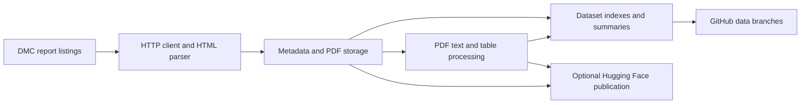

# Sri Lanka disaster report datasets

A standalone Python pipeline for collecting reports from the Sri Lankan Disaster
Management Centre, extracting PDF text and tables, and publishing datasets.

| Dataset label | Content |
|---|---|
| `lk_dmc_situation_reports` | Disaster situation reports |
| `lk_dmc_weather_forecasts` | Weather forecasts |
| `lk_dmc_river_water_level_and_flood_warnings` | River levels and flood warnings |
| `lk_dmc_landslide_warnings` | Landslide warnings |

## Architecture



The CLI coordinates independent modules in `src/dmc`. `sources.py` configures the
four categories; `client.py` handles HTTP; `parser.py` produces report metadata;
`storage.py` handles atomic file writes; `processing.py` extracts text and tables;
`summaries.py` builds indexes; and `publishing.py` exports and uploads datasets.

Runtime dependencies and their versions are declared in `pyproject.toml`.
`uv.lock` records the complete resolved environment. The pipeline runs on standard
Python and does not require a custom Docker image.

## Local setup

Requires Python 3.11 or newer and [uv](https://docs.astral.sh/uv/getting-started/installation/).

```powershell
uv sync --locked
uv run dmc --help
uv run pytest -q
```

A pip environment can instead install with `python -m pip install -r requirements.txt`.
Use uv for the fully locked environment and development checks.

Collect one page and process at most one pending PDF:

```powershell
uv run dmc scrape lk_dmc_situation_reports --max-pages 1 --max-documents 1
```

Collect listing metadata without downloading PDFs:

```powershell
uv run dmc scrape lk_dmc_weather_forecasts --metadata-only --max-pages 2
```

All output defaults to `data/`, which is ignored by Git in the code checkout.
`--data-dir` selects a different root. `--max-seconds` defaults to 300 seconds for
metadata collection and a separate 300 seconds for PDF processing. Limits are
cooperative: an active PDF extraction can finish after the stage budget. HTTP has
30-second socket timeouts, deadline checks, capped retry delays, and a 50 MiB
response/download limit. `--max-pages` defaults to 10,000. `--max-documents` counts
processing attempts, including failures, and does not limit listing metadata.

Collection starts with the newest listing page each run. To backfill more history,
increase the page and time budgets. Existing metadata is preserved; already
processed PDFs are skipped. Failed processing is retried on subsequent runs.

The CLI prints a JSON run result. `limited: true` means a configured bound was
reached; it does not claim that the complete source history was collected.
Failures return exit code 1; usage errors return 2.

## Stored data and migration

```text
data/<dataset>/<decade>/<year>/<document-id>/
    doc.json          Source metadata
    doc.pdf           Original downloaded PDF
    doc.txt           Extracted text
    blocks.json       Page text records: page and text
    processing.json   Extraction status and pages without text
    tabular/*.csv     Extracted ruled tables, when available
```

Each dataset also contains `summary.json`, `run.json`, `README.md`, and
`docs_all.tsv` (plus recent-document TSV subsets when enough records exist).

Historical metadata fields, the document-ID shortening algorithm, and the
`<decade>/<year>/<document-id>` layout are retained. Matching metadata records are
not rewritten, including custom fields. Different PDF URLs sharing a title and
time are stored with a deterministic ID suffix rather than overwriting a record.

To use an existing data branch checkout, point the new CLI at its `data` directory:

```powershell
uv run dmc scrape lk_dmc_situation_reports --data-dir ../dataset/data
```

The old workflow script paths remain available after installation:

```powershell
uv run python workflows/pipeline.py lk_dmc_situation_reports 300 --data-dir ../dataset/data
uv run python workflows/build_global_readme.py --data-dir ../dataset/data
```

The former inherited document-class Python API has been replaced by `SOURCES`,
`Report`, and `run_pipeline`. Local publication is now explicit.

PDF extraction uses [pdfplumber](https://github.com/jsvine/pdfplumber). It extracts
text layers and ruled tables; it does not perform OCR or recompress PDFs. Scanned
pages are reported in `processing.json`. New blocks contain page-level text, so
consumers expecting the former detailed block structure need adaptation. Exact
extraction parity is not guaranteed. Existing processing outputs without a status
file are regenerated on their first processing run; original PDFs remain intact.

New metadata uses `lang: "und"` when document language is unknown, rather than
inferring it from website navigation. DMC listing times are interpreted as Sri
Lanka time (UTC+05:30). Existing metadata language and timestamps remain intact.

## Hugging Face publishing

Set `HUGGING_FACE_USERNAME` to your account or organization and set a write-enabled
`HUGGING_FACE_TOKEN` (or `HF_TOKEN`) in your environment. Never commit the token.
Then publish the local archive:

```powershell
uv run dmc publish lk_dmc_situation_reports
```

Alternatively, pass `--hf-namespace YOUR_NAMESPACE`. Add `--publish` to a scrape
command to publish after a collection run without errors.

The publisher creates two dataset repositories per label:

- `<namespace>/<label-with-hyphens>-docs`: all metadata records and available text.
- `<namespace>/<label-with-hyphens>-chunks`: nonempty text in chunks of up to 2,000
  characters with 200-character overlap.

Exports stream into `hugging_face_data/docs.jsonl` and `chunks.jsonl`. Metadata
without extracted text remains in the docs dataset with an empty text field.
Dataset cards select these JSONL files as the train split; historical Parquet
files, if present remotely, are not deleted but are excluded by this configuration.
This changes the published serialization from the former Parquet export.
Uploads use the [Hugging Face Hub API](https://huggingface.co/docs/huggingface_hub/guides/upload).
An upload failure propagates to the caller. The two repository uploads are separate
operations, so one can succeed before the other fails; rerun publication to retry.

## GitHub Actions

The collection workflow runs every two hours, with one job per dataset. It uses
standard Python, installs the locked environment, and runs tests before scraping.
It serializes updates to each data branch, saves successful collection progress
when a run has errors, and uses ordinary pushes. Rebase conflicts stop the push.
Hugging Face publication is skipped after collection errors and the job fails.

Setup in the repository where these workflows will run:

1. Provide the four existing `data_<dataset-label>` branches, containing each
   archive under `data/<dataset-label>`. These archives are not bundled with the
   source download. Empty data branches can be used to begin collecting anew.
2. Allow the workflow's built-in `GITHUB_TOKEN` to write repository contents.
3. For Hugging Face publication, set the repository variable
   `HUGGING_FACE_USERNAME` and secret `HUGGING_FACE_TOKEN`. If both are absent,
   collection and GitHub publication still run; partially configured publication
   fails with a clear error.
4. For a larger historical backfill, manually run the pipeline with an increased
   `max_dt` time budget.

The README workflow reads summaries from the current repository's data branches
through the GitHub Contents API, using the built-in token for private repositories.
It only updates the marked statistics section below, preserving setup instructions.
For local access to private repositories, set `GITHUB_TOKEN`, or use locally
checked-out summaries with `dmc readme --data-dir PATH`.

The test workflow covers Python 3.11 and 3.13 on Windows and Linux.

## Dataset statistics

Run `uv run dmc readme --data-dir data` after collecting reports to update this
section from local summaries. The source download does not contain the historical
PDF archive, so no historical totals are claimed here.

<!-- DATASETS:START -->

No dataset summaries have been generated for this checkout.

<!-- DATASETS:END -->
