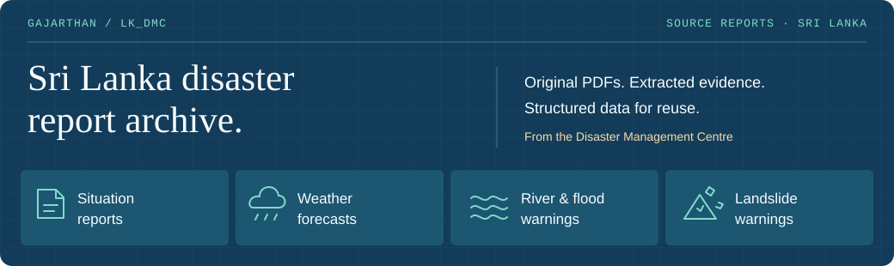
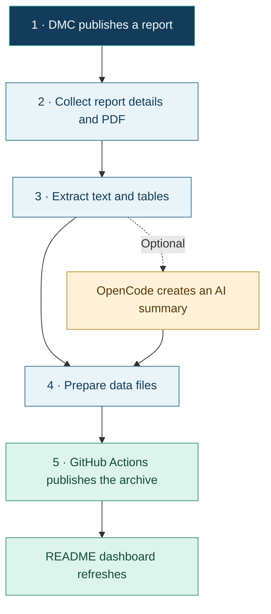

# Sri Lanka disaster reports, in one place

**Automatically collect official reports, turn PDFs into usable data, and publish the results on GitHub.** Add OpenCode to create AI summaries from the extracted text.

[**Data dashboard**](#archive-coverage) · [**How it works**](#how-it-works) · [**Quick start**](#quick-start) · [**OpenCode**](#add-opencode-analysis) · [**Automation**](#run-automatically-on-github) · [**Help**](#troubleshooting)

[](https://github.com/Gajarthan/lk_dmc/actions/workflows/pipeline.yml)
[](https://github.com/Gajarthan/lk_dmc/actions/workflows/tests.yml)
[](https://github.com/Gajarthan/lk_dmc/actions/workflows/build_global_readme.yml)
[](https://github.com/Gajarthan/lk_dmc/actions/workflows/opencode-check.yml)

| 📥 Collect | 📄 Read | ✨ Understand | 📦 Share |
|---|---|---|---|
| Reports from Sri Lanka's DMC | Original PDFs, text and tables | Optional AI summaries with OpenCode | Data files and indexes on GitHub |

> **Official source:** [Disaster Management Centre](https://www.dmc.gov.lk/). This is a report archive. For current warnings, check DMC. AI summaries should be checked against the original reports.

## How it works



**Who does what?** DMC supplies the reports. This Python project collects and processes them. OpenCode provides optional AI analysis. GitHub stores the published datasets and runs the automation. You can collect and publish without OpenCode.

## Archive coverage

These numbers come from the published data branches. Click a dataset name to browse its files. The badges above show workflow results; the OpenCode badge is the last manual check.

<!-- DATASETS:START -->

### Coverage

| Reports | Original PDFs | Extracted text | AI analyzed | With tables |
|:---:|:---:|:---:|:---:|:---:|
| **8,129** | **8,128** | **8,100** | **0** | **6,846** |

**Report files:** 4092.5 MiB · **Latest summary:** 2026-09-17 07:56 UTC · **Sources reporting:** 4/4

### Dataset monitor

| Dataset | Reports | PDFs | Text | AI | Newest report | Collection |
|---|---:|---:|---:|---:|---|---|
| [Situation reports](https://github.com/Gajarthan/lk_dmc/tree/data_lk_dmc_situation_reports/data/lk_dmc_situation_reports) | 2,767 | 2,766 | 2,765 | 0 | 2026-09-17 | Needs attention |
| [Weather forecasts](https://github.com/Gajarthan/lk_dmc/tree/data_lk_dmc_weather_forecasts/data/lk_dmc_weather_forecasts) | 2,084 | 2,084 | 2,084 | 0 | 2026-09-17 | Needs attention |
| [River and flood warnings](https://github.com/Gajarthan/lk_dmc/tree/data_lk_dmc_river_water_level_and_flood_warnings/data/lk_dmc_river_water_level_and_flood_warnings) | 2,479 | 2,479 | 2,453 | 0 | 2026-09-17 | Needs attention |
| [Landslide warnings](https://github.com/Gajarthan/lk_dmc/tree/data_lk_dmc_landslide_warnings/data/lk_dmc_landslide_warnings) | 799 | 799 | 798 | 0 | 2026-09-16 | Needs attention |

Counts describe archived files. AI counts include only validated results matching the current source text. **Bounded run** means a collection limit was reached; it does not mean the full source history is archived.

### Recent source reports

| Report date | Dataset | Report | Source | AI |
|---|---|---|---|---|
| 2026-09-17 | Situation reports | situation report | [PDF](https://www.dmc.gov.lk/images/dmcreports/Drought_Situation_Report_on_2026__1789623308.pdf) | Pending |
| 2026-09-17 | Situation reports | situation report | [PDF](https://www.dmc.gov.lk/images/dmcreports/Situation_Report_on_2026__1789623228.pdf) | Pending |
| 2026-09-17 | Weather forecasts | Weather Forecast (Tamil Language) | [PDF](https://www.dmc.gov.lk/images/dmcreports/Weather_Report_at_0530hrs_on_2026__1789611209.pdf) | Pending |
| 2026-09-17 | River and flood warnings | Water Level | [PDF](https://www.dmc.gov.lk/images/dmcreports/Water_level_&_Rainfall_2026__1789606719.pdf) | Pending |
| 2026-09-17 | Weather forecasts | Weather Forecast | [PDF](https://www.dmc.gov.lk/images/dmcreports/Weather_Report_at_0530hrs_on_2026__1789604487.pdf) | Pending |
| 2026-09-16 | River and flood warnings | Water Level | [PDF](https://www.dmc.gov.lk/images/dmcreports/Water_level_&_Rainfall_2026__1789564722.pdf) | Pending |
| 2026-09-16 | Weather forecasts | Weather Forecast (Tamil Language) | [PDF](https://www.dmc.gov.lk/images/dmcreports/Weather_Report_at_1600_hrs_on_2026__1789557923.pdf) | Pending |
| 2026-09-16 | Weather forecasts | Weather Forecast | [PDF](https://www.dmc.gov.lk/images/dmcreports/Weather_Report_at_1600hrs_on_2026__1789555389.pdf) | Pending |

This section refreshes after pipeline completion and on the scheduled dashboard refresh. Workflow badges show the latest workflow result, not real-time service health.

<!-- DATASETS:END -->

<details>
<summary><strong>What do the numbers and statuses mean?</strong></summary>

| Label | Meaning |
|---|---|
| Reports | Saved report records; a PDF may still need downloading |
| PDFs / Text | Reports with a saved PDF / nonempty extracted text |
| AI | Reports with valid analysis matching the current source text |
| With tables | Reports with at least one extracted table |
| Waiting for reports | The published archive is empty |
| Bounded run | A time, page or processing limit was reached |
| Needs attention | Collection or PDF processing recorded an error |
| Not reported / Not available | A metric / dataset summary is missing |
| Latest summary | Time of the newest published dataset summary, in UTC |

Totals describe stored files, not how much of DMC's entire history has been collected. Up to eight recent reports are shown. The dashboard refreshes after collection workflow completion, on its two-hour schedule, or when run manually.

</details>

## Quick start

You need **Git**, **Python 3.11+**, and [**uv**](https://docs.astral.sh/uv/getting-started/installation/). Run these commands in a terminal; the configuration examples below use PowerShell.

**1. Download and install**

```powershell
git clone https://github.com/Gajarthan/lk_dmc.git
cd lk_dmc
uv sync --locked
```

**2. Try a small collection**

Read one listing page and attempt to process one PDF:

```powershell
uv run dmc scrape lk_dmc_situation_reports --max-pages 1 --max-documents 1
```

**3. Create reusable data files**

```powershell
uv run dmc export lk_dmc_situation_reports
```

Find the results in `data/lk_dmc_situation_reports/`. The export command writes files on your computer. The [GitHub workflow](#run-automatically-on-github) publishes them online.

### Choose a dataset

Replace `lk_dmc_situation_reports` in commands with any label below.

| Reports you want | Dataset label |
|---|---|
| Disaster situation reports | `lk_dmc_situation_reports` |
| Weather forecasts | `lk_dmc_weather_forecasts` |
| River levels and flood warnings | `lk_dmc_river_water_level_and_flood_warnings` |
| Landslide warnings | `lk_dmc_landslide_warnings` |

<details>
<summary><strong>More commands: metadata only, another folder, dashboard and tests</strong></summary>

```powershell
# Collect details without downloading PDFs
uv run dmc scrape lk_dmc_weather_forecasts --metadata-only --max-pages 2

# Use an existing archive in a different folder
uv run dmc scrape lk_dmc_situation_reports --data-dir ../dataset/data

# Refresh the README from local dataset summaries
uv run dmc readme --data-dir data

# Refresh from this repository's published branches
uv run dmc readme --repository Gajarthan/lk_dmc

# Show available commands and run development checks
uv run dmc --help
uv run pytest -q
uv run ruff check .
uv run ruff format --check .
```

Use `--output PATH` with `readme` to write a separate Markdown file. Set `GITHUB_TOKEN` when reading a private repository. A pip environment can use `python -m pip install -r requirements.txt`; uv provides the locked environment and development tools.

</details>

## Add OpenCode analysis

**OpenCode reads extracted report text and returns a structured AI summary.** It does not store the published dataset. Your original PDFs and source links stay in the archive.

| Result | What it contains |
|---|---|
| `summary` | A short explanation of the report |
| `disaster_types`, `locations` | Reported hazards and places |
| `report_date` | The report date, or `null` if unknown |
| `impacts`, `warnings` | Effects and warnings described in the source |

**1. Connect to your OpenCode server**

```powershell
$env:OPENCODE_BASE_URL = "https://your-opencode-server.example"
$env:OPENCODE_USERNAME = "opencode"
$credential = Get-Credential -UserName "opencode" -Message "OpenCode credentials"
$env:OPENCODE_PASSWORD = $credential.GetNetworkCredential().Password
uv run dmc opencode-health
```

A healthy response confirms connectivity. The server also needs a working model provider to analyze reports. The default server model is used unless you set `OPENCODE_MODEL` to a configured `provider/model`.

**2. Analyze one collected report and export it**

```powershell
uv run dmc analyze lk_dmc_situation_reports --max-documents 1 --export
```

The report's `analysis.json` stores the result and its source information. The JSONL export includes matching successful analysis.

<details>
<summary><strong>OpenCode settings, API behavior and retry rules</strong></summary>

| Setting | Purpose |
|---|---|
| `OPENCODE_BASE_URL` | Your HTTPS OpenCode endpoint |
| `OPENCODE_USERNAME` | Basic Auth username; defaults to `opencode` |
| `OPENCODE_PASSWORD` | Basic Auth password; keep it in an environment variable or GitHub secret |
| `OPENCODE_MODEL` | Optional `provider/model`; otherwise use the server default |

[`.env.example`](.env.example) lists the settings. The CLI does **not** load `.env` files automatically. Model-provider credentials belong on the OpenCode server.

The client creates a session with `POST /session`, then submits text through `POST /session/{sessionID}/message`. It requests JSON text with a schema in the system prompt and validates the answer locally. Sessions deny all tool permissions. Report contents are treated as untrusted data; unknown lists are empty and unknown dates are null. See the [OpenCode server documentation](https://dev.opencode.ai/docs/server/).

`analysis.json` records the result, source SHA-256, configuration hash, schema version, timestamps, and available model/session identifiers. Matching successful results are skipped. Changes to text, endpoint, explicit model or schema trigger reanalysis. Use `--force` after changing the server's default model.

Failed reports are retried on later runs. New reports are attempted before old errors; failures rotate by last-attempt time. Empty or missing text is skipped. OpenCode does not perform OCR. Submitted text and sessions remain on your server under its retention policy.

POST requests are not automatically replayed after a transport error: the server may already have received them. A later retry can create another session and use additional model capacity.

To collect, analyze and export together:

```powershell
uv run dmc scrape lk_dmc_situation_reports --max-pages 1 --max-documents 1 --analyze --analysis-max-documents 1 --export
```

A collection error skips analysis; requested exports still preserve available records.

</details>

## Run automatically on GitHub

The repository's **pipeline** workflow collects all four datasets on a two-hour schedule. You can also start it from [**Actions → pipeline → Run workflow**](https://github.com/Gajarthan/lk_dmc/actions/workflows/pipeline.yml).

| Workflow | When it runs | What it does |
|---|---|---|
| [Collection](.github/workflows/pipeline.yml) | Every two hours or manually | Collect → extract → optionally analyze → export → publish |
| [Dashboard](.github/workflows/build_global_readme.yml) | After collection completes, every two hours, or manually | Read published summaries and update this page |
| [Tests](.github/workflows/tests.yml) | Code pushes and pull requests | Test Python 3.11/3.13 on Windows and Linux |
| [OpenCode check](.github/workflows/opencode-check.yml) | Manually | Check access and analyze one synthetic report |

### Set up automation in your repository

1. Provide four `data_<dataset-label>` branches. Each stores its archive under `data/<dataset-label>/`. Empty branches with that archive folder can begin a new collection; historical data is not bundled with the code.
2. Allow the workflow's built-in `GITHUB_TOKEN` to write repository contents.
3. To enable analysis, add the following under **Settings → Secrets and variables → Actions**:

   | Type | Name | Value |
   |---|---|---|
   | Variable | `OPENCODE_BASE_URL` | Your HTTPS server URL |
   | Secret | `OPENCODE_PASSWORD` | Your server password |
   | Variable, optional | `OPENCODE_USERNAME` | Defaults to `opencode` |
   | Variable, optional | `OPENCODE_MODEL` | A configured `provider/model` |

4. Run **pipeline**. For a larger historical collection, increase the manual `max_dt` time budget.

If both URL and password are absent, collection and publishing run without AI. Partial configuration fails with an explanation. The server must be reachable from GitHub's hosted runners.

<details>
<summary><strong>How publishing and failed runs are handled</strong></summary>

The pipeline installs locked dependencies and runs checks before scraping. Each dataset has its own job; updates to the same data branch are serialized. OpenCode analysis follows successful collection, then JSONL export and a Git push.

Successful progress is saved even when a stage reports errors. Collection, analysis or export errors still fail the job. Source collection continues on later runs even if OpenCode fails. Ordinary pushes are used; a rebase conflict stops publication.

The README workflow reads summaries through the GitHub Contents API. It replaces only the `DATASETS` comment block, preserving these instructions and diagrams. It uses the built-in token for private repositories.

The manual OpenCode check uses a clearly labeled synthetic report and never adds that test report to a dataset.

For manual publishing, export into your data branch checkout, then commit and push that branch. `dmc export` itself only creates local files.

</details>

## Find and use the files

A dataset is a folder of reports plus indexes and exports. **JSONL** means one JSON record per line; **TSV** is a table you can open in a spreadsheet.

```text
data/<dataset>/
├── summary.json              Counts used by this dashboard
├── run.json                  Latest collection run and errors
├── README.md                 Dataset overview
├── docs_all.tsv               Report index
├── exports/
│   ├── docs.jsonl             Report details, text and valid AI results
│   └── chunks.jsonl           Smaller text pieces for search or analysis
└── <decade>/<year>/<document-id>/
    ├── doc.json              Report details and source URL
    ├── doc.pdf               Original PDF
    ├── doc.txt               Extracted text
    ├── blocks.json           Text grouped by page
    ├── processing.json       PDF processing result
    ├── analysis.json         Optional AI result and source information
    └── tabular/*.csv          Extracted tables, when available
```

Files appear as their processing stage completes. Local `data/` is ignored by Git in the code checkout; published files live on the separate dataset branches.

<details>
<summary><strong>Export format and data quality details</strong></summary>

- `docs.jsonl` includes all metadata, available text and matching completed `analysis`, or `null`. Metadata-only reports remain included.
- `chunks.jsonl` contains nonempty text pieces of at most 2,000 characters with 200-character overlap. Whitespace-only pieces are omitted.
- Invalid source metadata stops export before existing files are replaced. Invalid or stale AI analysis is omitted while the source report is retained.
- [pdfplumber](https://github.com/jsvine/pdfplumber) extracts PDF text layers and ruled tables. It does not perform OCR or recompress PDFs. Scanned pages are reported in `processing.json`.
- Dataset indexes also include recent-document TSV subsets when enough records exist.
- New records use `lang: "und"` for unknown language. DMC listing times use Sri Lanka time (UTC+05:30); existing language and time values are preserved.

</details>

## Troubleshooting

| What you see | What to do |
|---|---|
| Zero reports on the dashboard | Run collection and check that its data-branch push succeeded. Then refresh the dashboard workflow. |
| Bounded run | Run again or increase page/time limits to collect more history. |
| A PDF has no text | It may be scanned. Check `processing.json`; this project does not include OCR. |
| AI count is zero | Confirm extracted text exists, check OpenCode configuration, and run `opencode-health` followed by a one-report analysis. |
| OpenCode health succeeds but analysis fails | Check the server's model/provider configuration and the saved analysis error. |
| OpenCode returns a proxy error | Check reverse-proxy logs and User-Agent filters. This client identifies itself as `DMC-Report-Collector/3.0`. |
| Workflow fails after saving data | Open its failed step. Successful progress may already be published; fix the error and retry. |
| Missing dashboard metric | Older summaries may not contain it. A new collection/analysis/export run refreshes the summary. |

<details>
<summary><strong>Processing limits and retry behavior</strong></summary>

| Stage | Default limit | Control |
|---|---|---|
| Listing collection | 300 seconds, up to 10,000 pages | `scrape --max-seconds`, `--max-pages` |
| PDF processing | A separate 300 seconds; no default document-count cap | `scrape --max-seconds`, `--max-documents` |
| AI analysis | 10 attempts, 300 seconds | `analyze --max-documents`, `--max-seconds` |
| Text sent for analysis | 40,000 characters per report | `analyze --max-characters` |

When analysis is part of `scrape`, use `--analysis-max-documents`, `--analysis-max-seconds` and `--analysis-max-characters`. The workflow applies its `max_dt` budget to collection, PDF processing and analysis separately.

Limits are cooperative: an active PDF extraction can finish after the budget. HTTP uses 30-second socket timeouts, deadline checks, capped retry delays and a 50 MiB response/download limit. Oversized analysis input fails explicitly; text is never silently truncated.

Collection begins at the newest listing page each run. Increase page/time budgets to reach older history. Saved metadata is preserved, processed PDFs are skipped, and processing failures are retried. `--max-documents` counts processing attempts, including failures; it does not limit listing metadata.

The CLI prints a JSON run result. `limited: true` means a configured bound was reached. Exit code `0` means success, `1` a run failure, and `2` a usage/configuration error.

</details>

## Development and migration

<details>
<summary><strong>Code map and dependencies</strong></summary>

| Module in `src/dmc/` | Responsibility |
|---|---|
| `cli.py` / `pipeline.py` | Commands and collection stages |
| `sources.py` / `models.py` | Dataset configuration and report records |
| `client.py` / `parser.py` | HTTP requests and listing parsing |
| `storage.py` / `processing.py` | Safe file writes and PDF extraction |
| `opencode.py` / `analysis.py` | OpenCode API access and resumable analysis |
| `publishing.py` | Local JSONL exports |
| `summaries.py` / `dashboard.py` | Dataset indexes, counts and README rendering |

Runtime dependencies are in [`pyproject.toml`](pyproject.toml); [`uv.lock`](uv.lock) pins the resolved environment. The project runs on standard Python without a custom Docker image. [Tests](tests/) cover collection, processing, exports, analysis and dashboard behavior. The project uses the [MIT license](LICENSE).

</details>

<details>
<summary><strong>Moving an existing archive to version 3</strong></summary>

Existing metadata fields, document-ID shortening and the `<decade>/<year>/<document-id>` layout are retained. Matching metadata, including custom fields, is not rewritten. Different PDF URLs with the same title/time receive deterministic ID suffixes.

Point `--data-dir` at your existing checkout's `data` directory. Older script entry points remain available after installation:

```powershell
uv run python workflows/pipeline.py lk_dmc_situation_reports 300 --data-dir ../dataset/data
uv run python workflows/build_global_readme.py --data-dir ../dataset/data
```

The inherited document-class API is replaced by `SOURCES`, `Report` and `run_pipeline`. Version 3 removes `publish`, `--publish` and the previous hub-specific settings. Use `analyze --export` for AI-enriched files, or `export` for source data alone. Existing remote datasets are not deleted.

New `blocks.json` files contain page-level text. Consumers expecting detailed legacy blocks need adaptation. Extraction may differ from the older pipeline. Processing outputs without a status file are regenerated on their next processing run; original PDFs remain intact.

</details>
